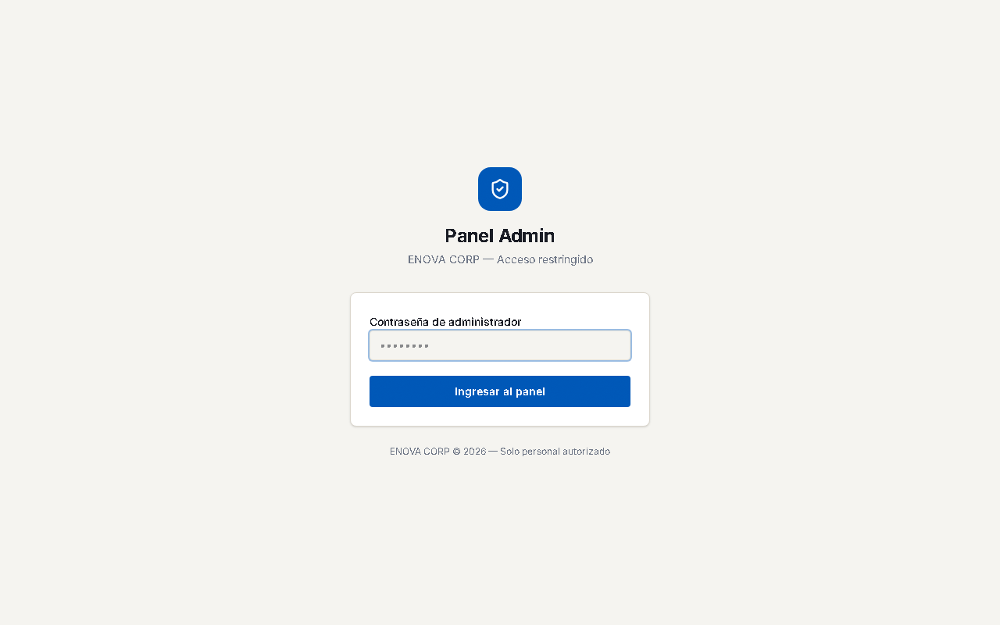
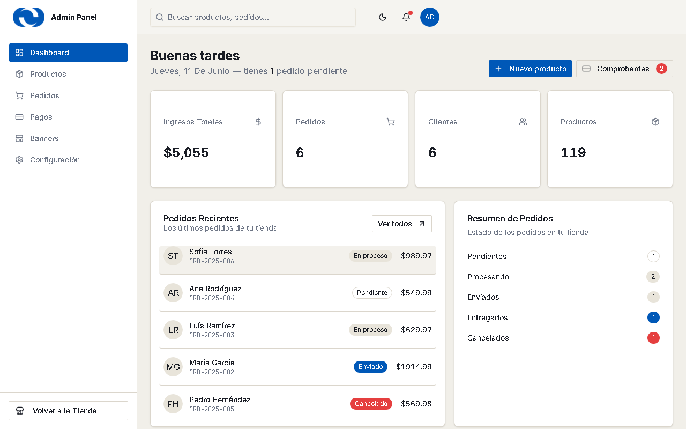
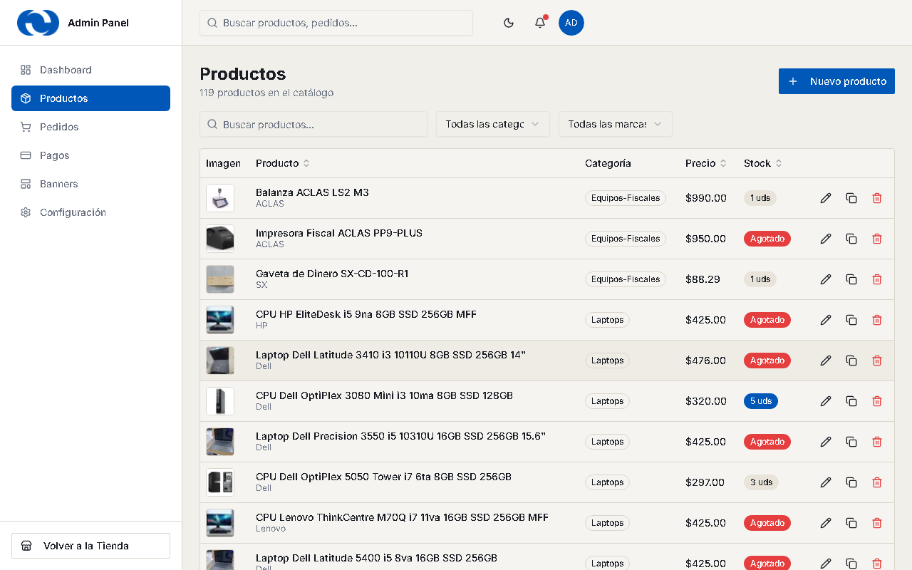
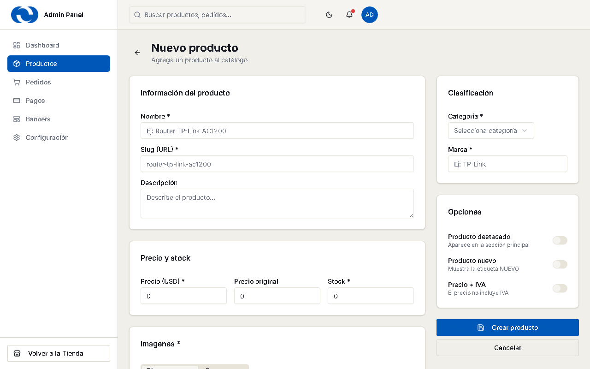
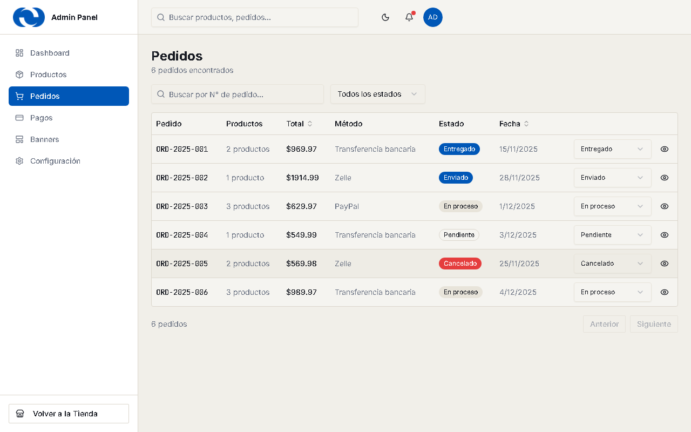
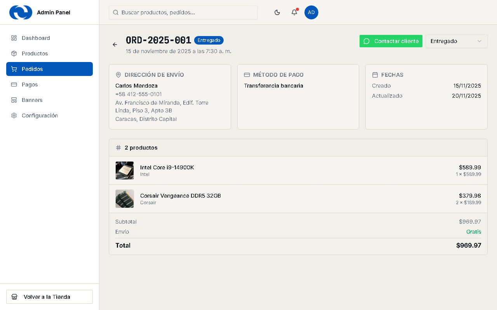
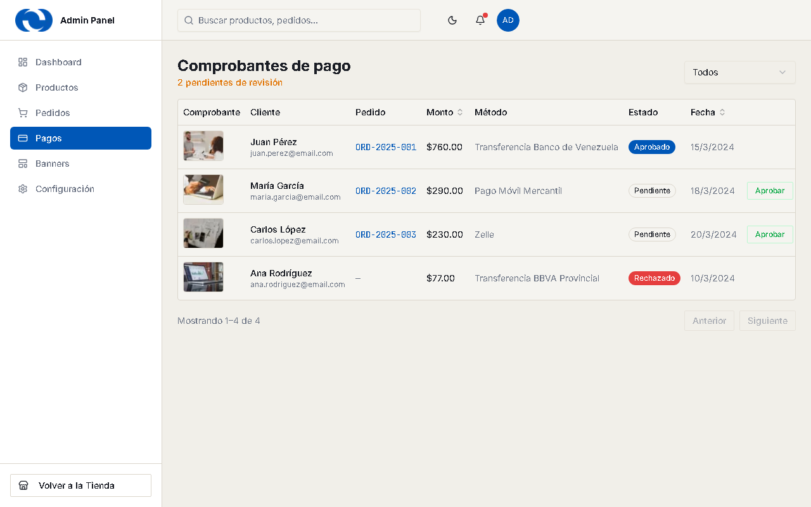
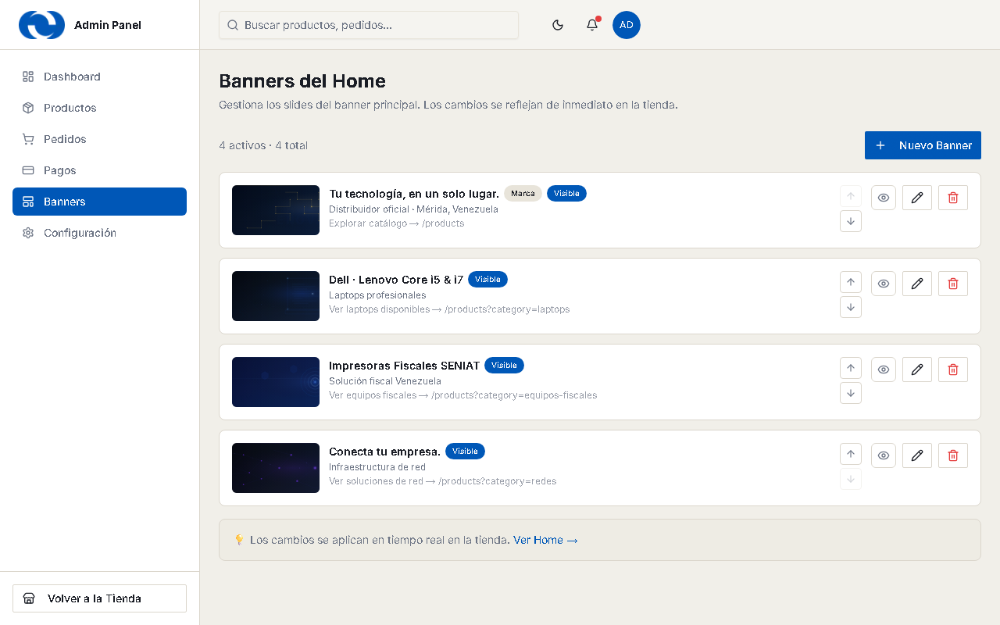
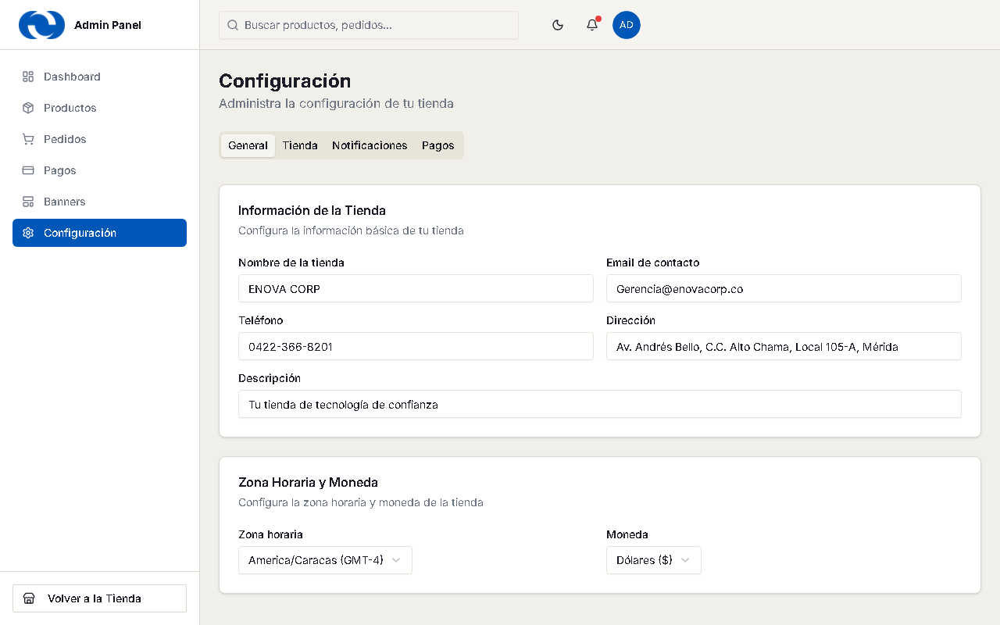

# Manual del Panel de Administración — ENOVA CORP

*Guía rápida para el equipo de la tienda. Sin tecnicismos.*
*Versión: junio 2026*

---

## 1. Entrar al panel

Abre **tusitio.com/admin** en el navegador. Te pedirá la contraseña de administrador.

- La sesión dura **7 días**; después te pedirá la contraseña de nuevo.
- Si te equivocas 5 veces seguidas, el acceso se bloquea **15 minutos** por seguridad.
- Para **salir**: clic en el círculo azul "AD" (arriba a la derecha) → *Cerrar sesión*.

> ⚠️ **Importante:** trabaja siempre desde **el mismo navegador y la misma computadora**.
> Los cambios que hagas (productos, banners) se guardan en ese navegador. No borres el
> historial/datos de navegación del sitio, o perderás tus cambios. *(Esto cambiará cuando
> se conecte la base de datos.)*

## 2. El Dashboard (pantalla principal)

Lo primero que ves al entrar: el resumen del negocio.

- **Las 4 tarjetas:** ingresos totales, pedidos, clientes y productos del catálogo.
- **Pedidos Recientes:** los últimos 5 — haz clic en cualquiera para ver su detalle.
- **El saludo te dice cuántos pedidos pendientes tienes** — esa es tu lista de tareas del día.
- Botones rápidos: **+ Nuevo producto** y **Comprobantes** (el número rojo = pagos por revisar).
- La **campanita** 🔔 también te avisa si hay comprobantes pendientes.

## 3. Productos

Aquí está todo tu catálogo. Puedes **buscar** por nombre y **filtrar** por categoría o marca.

Cada fila tiene 3 botones a la derecha:
- ✏️ **Editar** — cambiar precio, stock, fotos, descripción.
- 📄 **Duplicar** — crea una copia para variantes del mismo equipo (le pone "(copia)" al nombre; edítala después).
- 🗑️ **Eliminar** — pide confirmación con el nombre del producto. **No se puede deshacer.**

### Crear un producto nuevo

Botón **+ Nuevo producto** (en Productos o en el Dashboard):

1. Escribe el **nombre** (la dirección web del producto se genera sola).
2. **Precio** en USD y **stock** (cuántas unidades tienes).
3. Elige **categoría** y escribe la **marca**.
4. Sube al menos **una foto** (desde tu computadora o pegando un enlace).
5. Agrega **especificaciones** con "Añadir fila" (ej: Tipo → DDR4).
6. **Guardar** — el producto aparece en la tienda de inmediato.

Interruptores útiles: **Destacado** (sale en el home), **Nuevo** (badge "Nuevo"),
**+IVA** (el precio mostrará "+ IVA").

## 4. Pedidos

Cada compra de la web aparece aquí. Puedes buscar por número de pedido y filtrar por estado.

**Los estados y cuándo usarlos:**
| Estado | Cuándo |
|---|---|
| Pendiente | Pedido nuevo, sin verificar el pago |
| En proceso | Pago verificado, preparando el envío |
| Enviado | Despachado por MRW/Zoom |
| Entregado | El cliente lo recibió |
| Cancelado | No se concretó |

Cambia el estado directo desde la lista (menú desplegable) o desde el detalle.

### Detalle del pedido

Clic en el ojito 👁 de cualquier pedido:

- Datos de envío, método de pago, productos y totales.
- **Botón verde "Contactar cliente"**: abre WhatsApp directo al teléfono del cliente con
  un mensaje ya escrito (su número de pedido y total). Úsalo para confirmar pagos y avisar envíos.

> 📦 Al verificar un pago, **ajusta a mano el stock** del producto vendido (Productos → Editar).

## 5. Pagos (comprobantes)

Los comprobantes por revisar. Haz clic en la **miniatura** para ver el comprobante en grande.

- ✅ **Aprobar** — el pago es válido (pasa el pedido a "En proceso").
- ❌ **Rechazar** — no llegó o no coincide (contacta al cliente por WhatsApp).
- Ambos piden confirmación antes de aplicar.

## 6. Banners del Home

Las imágenes grandes que rotan en la portada de la tienda. Puedes **crear**, **editar**,
**reordenar** (flechas ↑↓) y **activar/desactivar** cada banner sin eliminarlo.

## 7. Configuración

Datos de la tienda organizados en 4 pestañas (General, Tienda, Notificaciones, Pagos).
Pulsa **Guardar** después de cambiar algo.

> ⚠️ **Tasa BCV manual** (pestaña Tienda): déjala **vacía**. Solo se usa como respaldo si
> la tasa automática del BCV falla. Si escribes un valor viejo aquí, los precios en Bs.
> saldrán mal.

## 8. Qué NO tocar

- No compartas la contraseña del admin — es la llave de todo.
- No uses la "Tasa BCV manual" salvo emergencia (ver arriba).
- No borres productos para "ocultarlos" — mejor edítalos y pon stock 0.
- No limpies los datos de navegación del navegador donde administras (ver advertencia §1).

## 9. Limitaciones actuales (honestas)

- Los pedidos que hacen los clientes **desde sus teléfonos** te llegan por **WhatsApp**
  (el botón final de su compra les arma el mensaje con todo el pedido). La lista de
  Pedidos del panel muestra los pedidos hechos en este mismo navegador.
- El stock no se descuenta solo: ajústalo al confirmar cada venta.
- Ambas cosas se resuelven cuando se conecte la base de datos (siguiente fase del proyecto).

---

*¿Algo no funciona como dice este manual? Escríbenos y lo revisamos.*
