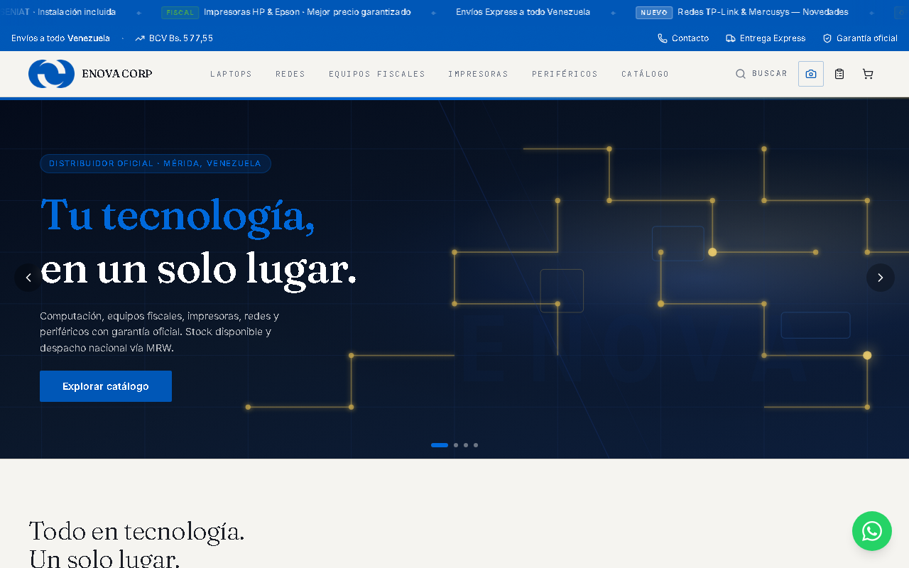
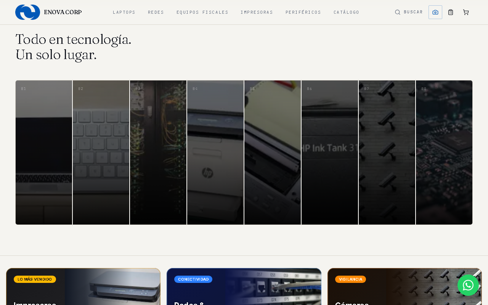
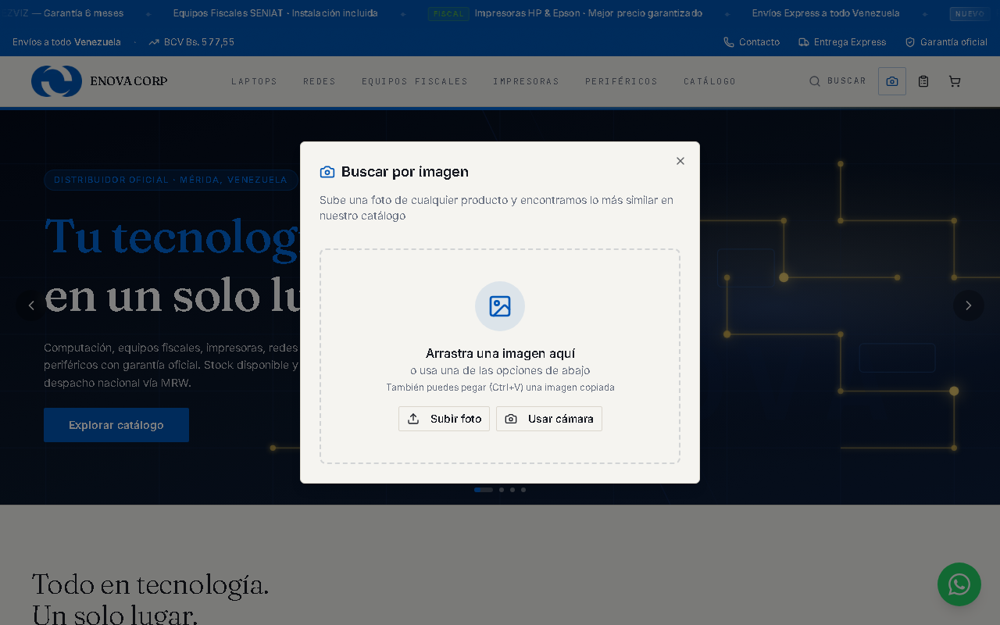
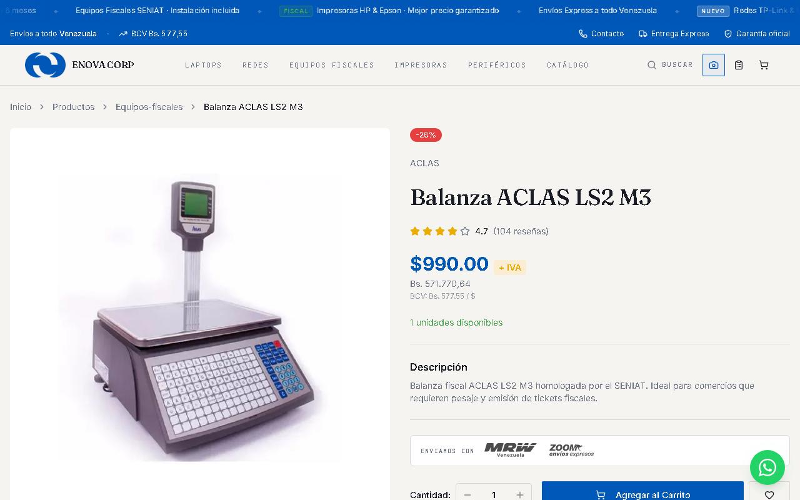
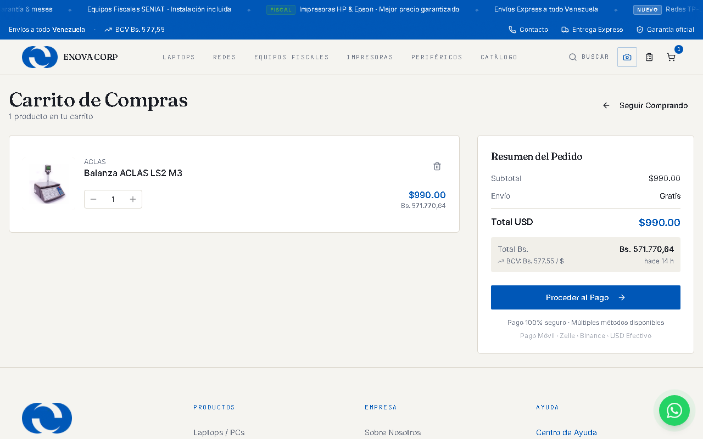
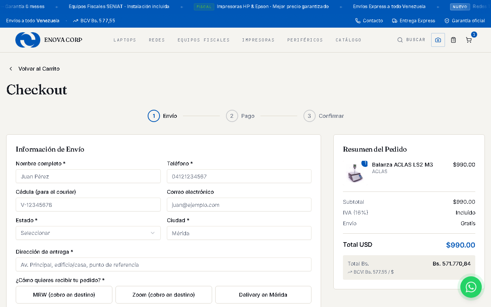
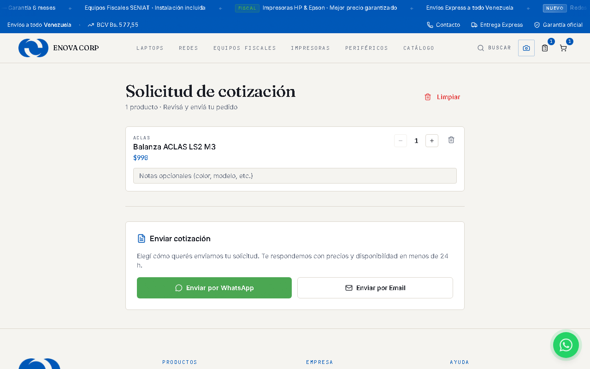
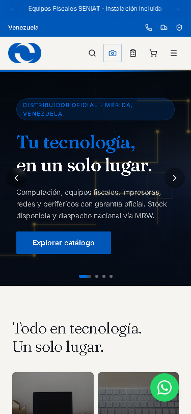
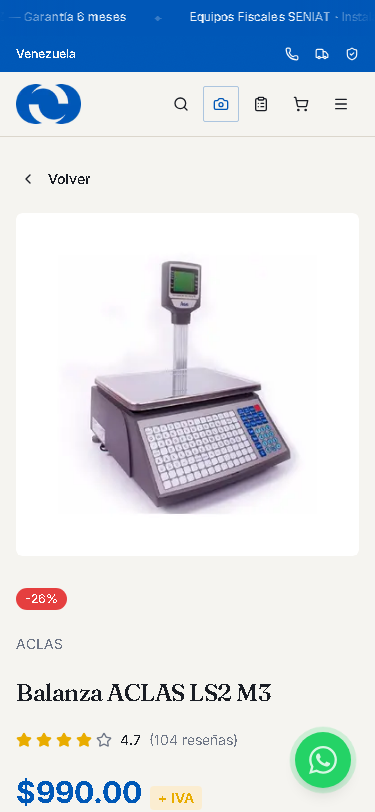
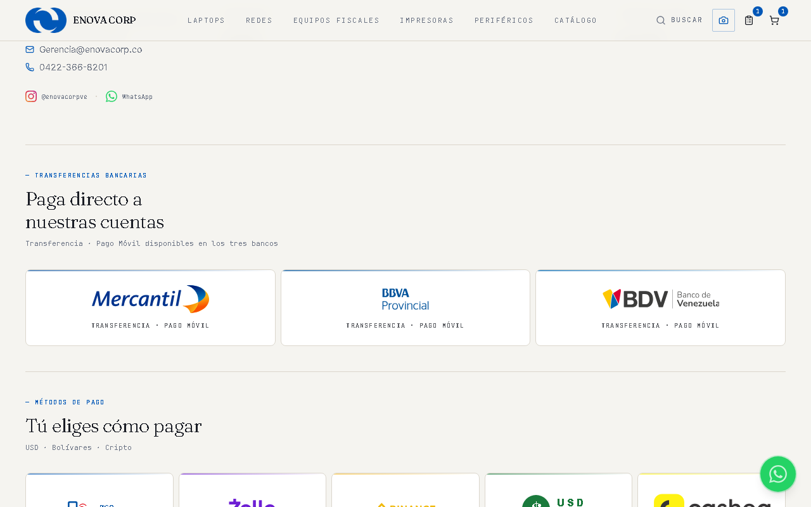

# Manual de la Tienda Web — ENOVA CORP

*Qué tiene tu tienda, por qué es mejor que otras, y cómo sacarle provecho como vendedor.*
*Versión: junio 2026 · Su manual hermano: [MANUAL-ADMIN.md](MANUAL-ADMIN.md)*

---

## 1. Una portada que vende sola

La página de inicio guía al visitante: banners de promociones, categorías, cómo comprar
en 4 pasos, productos destacados, testimonios y marcas.

**Tu beneficio:** los banners y los productos destacados **los controlas tú desde el panel**
(ver manual del admin) — cuando tengas una promo, la portada cambia en minutos sin pagarle
a nadie.

Las categorías reaccionan al pasar el cursor (efecto de acordeón) — un detalle visual que
las tiendas promedio no tienen y que da sensación de marca cara.

## 2. Tasa BCV en vivo — tu arma de confianza

Arriba de cada página se muestra la **tasa BCV oficial del día**, y en el carrito cada
total en bolívares indica con qué tasa se calculó y hace cuánto se actualizó.

**Tu beneficio:** en Venezuela la desconfianza cambiaria mata ventas. Tu tienda muestra
la tasa abiertamente — el cliente sabe que no hay "tasa inventada". Eso te diferencia de
la mayoría, que esconde el cálculo. Y si la fuente oficial falla, la tienda sigue usando
la última tasa conocida (nunca muestra precios rotos).

## 3. Búsqueda por imagen con Inteligencia Artificial

El cliente sube una **foto de cualquier equipo** (o la toma con la cámara) y la tienda
encuentra los productos más parecidos del catálogo.

**Tu beneficio:** es tu mejor argumento de "mira lo que tiene mi web". El caso típico:
un cliente te manda foto por WhatsApp de un equipo que vio en otro lado — ahora puede
subirla él mismo y encontrar tu equivalente al instante. Casi ninguna tienda venezolana
tiene esto. (También hay búsqueda por texto: la lupa, o Ctrl+K en computadora.)

## 4. Páginas de producto que convierten

Cada producto tiene: galería de fotos, precio en USD **y** bolívares, especificaciones
técnicas, disponibilidad, y productos relacionados para seguir vendiendo.

**Tu beneficio:**
- Cuando queda poco stock aparece **"¡Últimas X unidades!"** — urgencia real que empuja la decisión.
- Si un producto se agota, el botón no muere: se convierte en **"Consultar por WhatsApp"** — el agotado también te genera conversaciones.
- Productos sin precio público muestran **"Bajo cotización"** — perfecto para equipos fiscales que cotizas a medida.

## 5. Carrito y checkout pensados para Venezuela

**Envío gratis desde $200** (visible: "agrega $X más para envío gratis" — sube el ticket
promedio solo), total en bolívares a la tasa del momento, y los métodos que tu cliente
de verdad usa.

El pago se hace en 3 pasos con validación de datos venezolanos (teléfonos 0412/0414/0416/
0424/0426, estados del país, courier MRW o Zoom a elección).

**Tu beneficio:** al confirmar, el cliente recibe su **número de pedido** y un botón que
le abre WhatsApp **con el pedido completo ya escrito** (productos, total, referencia).
Tú recibes el mensaje listo para verificar el pago — sin dictado de productos por teléfono,
sin errores de monto.

## 6. Cotización corporativa (B2B)

Un flujo aparte para empresas: arman su lista de equipos (con notas por producto) y la
envían por WhatsApp o correo formal.

**Tu beneficio:** captas al cliente corporativo —el de los pedidos grandes— sin obligarlo
a "comprar" como consumidor. La página B2B explica precios por proyecto y la promesa de
respuesta en 24h.

## 7. WhatsApp en todo el recorrido

El botón verde flotante está en cada página, y cada punto del flujo (producto agotado,
cotización, pedido confirmado, garantía) lleva a WhatsApp **con el mensaje ya armado y el
contexto incluido**.

**Tu beneficio:** la web no reemplaza tu venta por WhatsApp — **te la alimenta con
mensajes ordenados** que llegan con producto, monto y referencia. Menos preguntas, más cierres.

## 8. Primero el teléfono

  
  &nbsp;&nbsp;
  

Todo el recorrido está diseñado para el teléfono primero (así compra la mayoría en
Venezuela): menú adaptado, botones grandes, cero scroll lateral. Además, desde Android
se puede **"Añadir a pantalla de inicio"** y tu tienda queda con ícono propio, como una app.

## 9. Lo invisible que también vende

Cosas que el cliente no "ve" pero que trabajan para ti:

- **Google te entiende:** la tienda tiene mapa del sitio y datos estructurados — Google
  puede mostrar tus productos con **precio y disponibilidad directamente en los resultados**
  de búsqueda, y tu negocio con dirección y teléfono.
- **Compartir se ve profesional:** al pegar el link de la tienda en WhatsApp o Instagram
  sale con imagen y descripción de marca, no un link pelado.
- **Velocidad:** páginas de producto pre-generadas, carga rápida, cero saltos de diseño
  mientras carga. Una tienda lenta pierde al cliente impaciente.
- **Seguridad:** conexión cifrada, protecciones contra suplantación (nadie puede meter tu
  web dentro de otra página), panel de administración con acceso blindado.
- **Medición:** desde junio 2026 la tienda registra visitas (Vercel Analytics) — pronto
  sabrás qué productos mira la gente y de dónde llega, para decidir con datos.
- **Transparencia legal:** términos, garantía por categoría, política de privacidad y
  cuentas bancarias visibles en el pie de página — todo lo que un comprador desconfiado
  revisa antes de pagar.

## 10. Cómo sacarle provecho (tips de vendedor)

1. **Comparte links de producto, no capturas.** El link lleva foto, precio y se abre en la
   tienda con el botón de compra: `tusitio.com/products/nombre-del-producto`.
2. **Usa los banners como tu cartelera** — promo de la semana, llegada de mercancía,
   temporada (ver manual del admin §6).
3. **Marca como "Destacado"** lo que quieres empujar — sale en la portada.
4. **El badge "Nuevo"** atrae clics: úsalo en cada llegada de mercancía (y quítalo después,
   para que no pierda efecto).
5. **Stock bajo = urgencia gratis:** mantén el stock real en el panel y la web hace el
   resto ("¡Últimas 2!").
6. **Responde las cotizaciones B2B en menos de 24h** — la web lo promete por ti.
7. **Pon el link de la tienda en la bio de Instagram y en tu estado de WhatsApp** — la web
   es tu catálogo que nunca duerme.

---

## Ficha rápida: qué tiene tu tienda que otras no

✔ Búsqueda por imagen con IA · ✔ Tasa BCV en vivo y visible · ✔ Precios en USD y Bs
simultáneos · ✔ Pedido por WhatsApp armado automáticamente · ✔ Flujo B2B de cotización ·
✔ Urgencia de stock real · ✔ Agotados que generan conversaciones · ✔ Checkout validado
para datos venezolanos · ✔ Envío gratis configurable que sube el ticket · ✔ Google-ready
con precio en resultados · ✔ Diseño propio (no plantilla) con tipografía editorial ·
✔ Rápida, segura y medible.

*¿Algo no funciona como dice este manual? Escríbenos y lo revisamos.*
